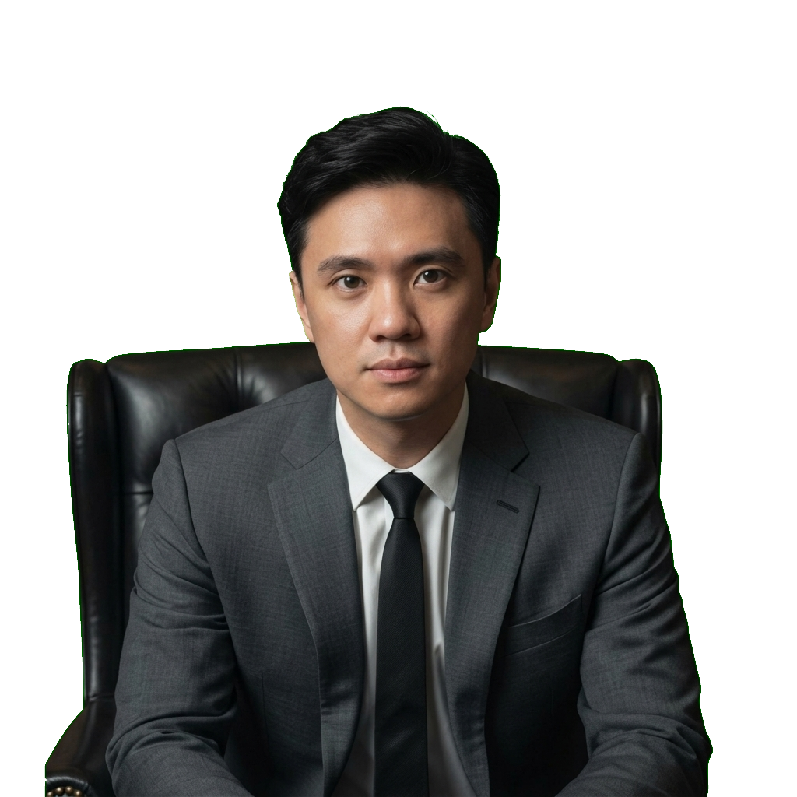
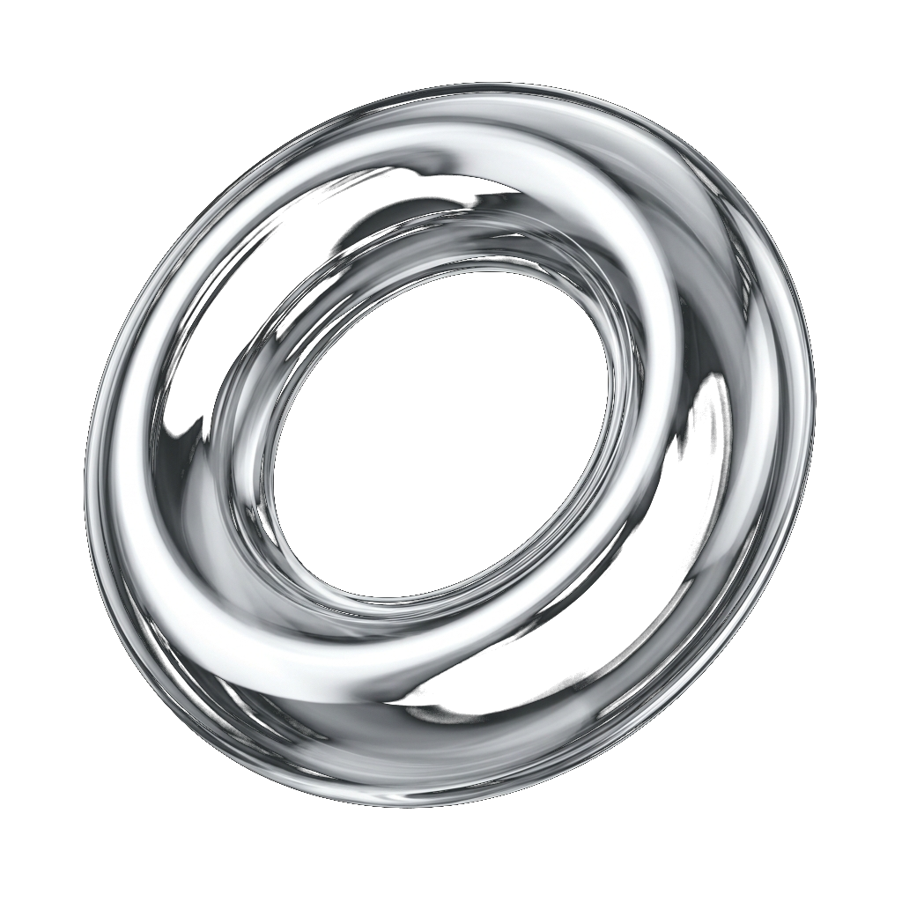
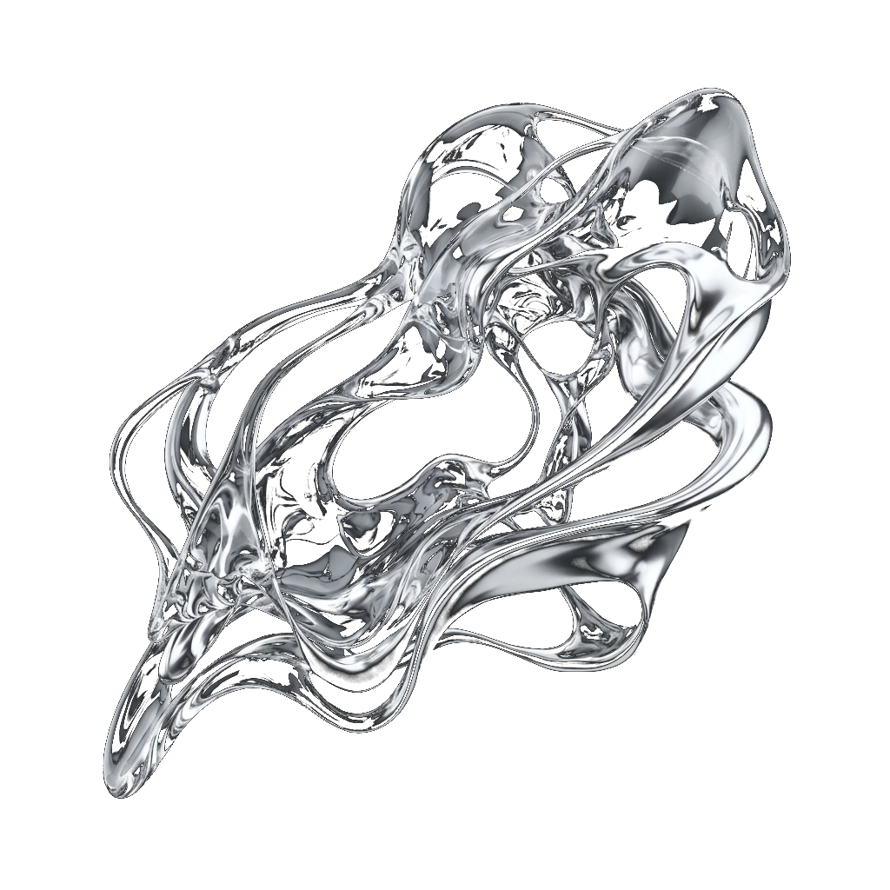
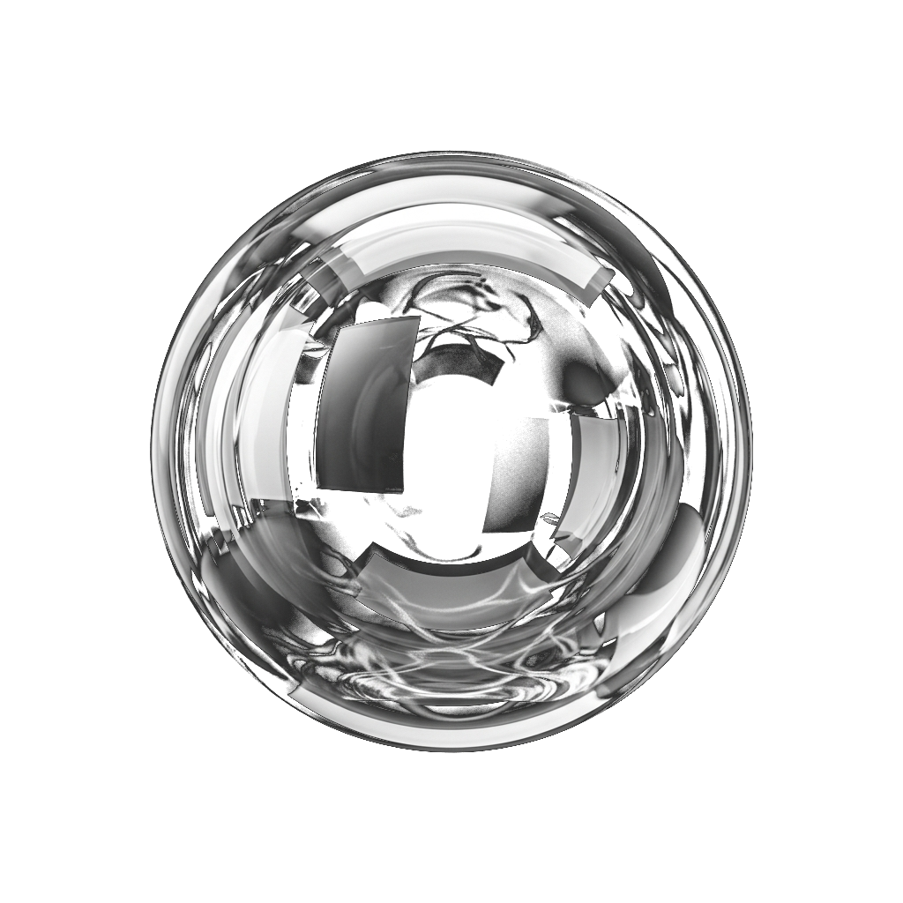
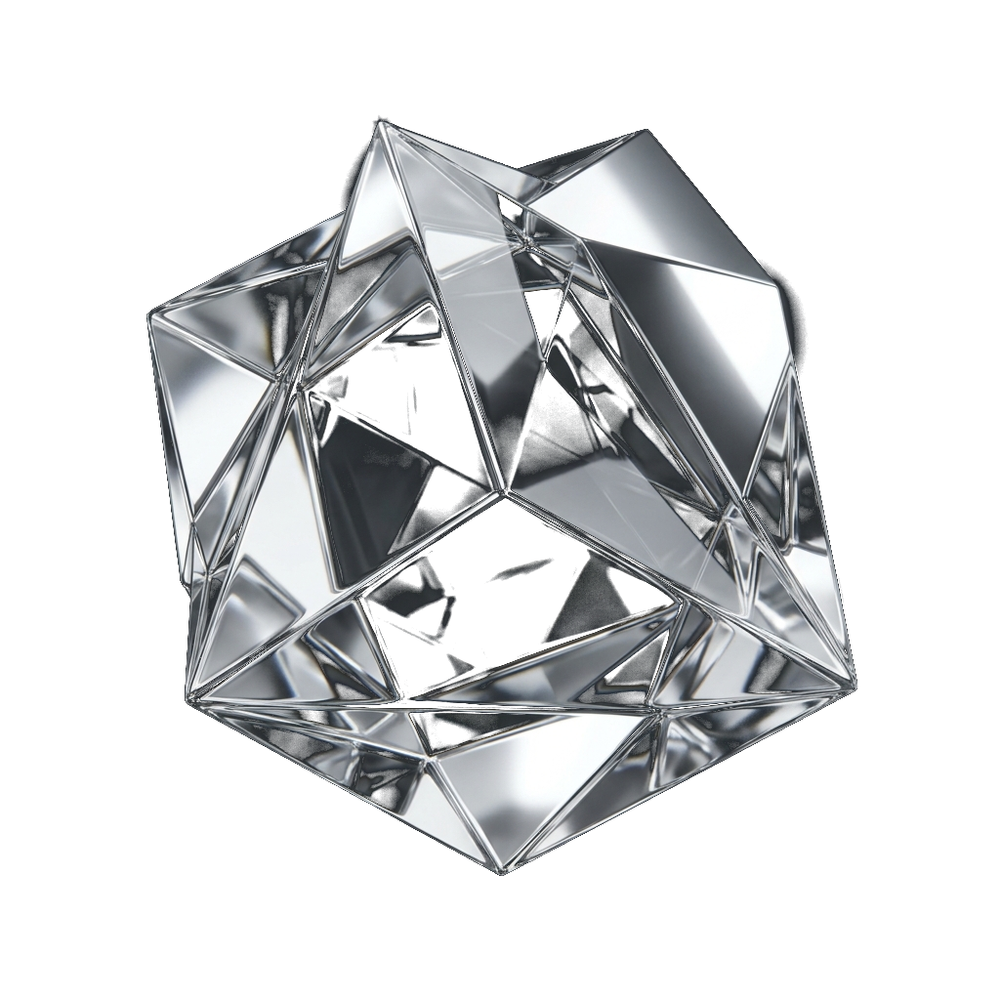

# Panduan Re-use & Kode Sumber Landing Page

Dokumen ini berisi panduan lengkap untuk menggunakan kembali kode sumber (*source code*) landing page ini bagi individu atau personal branding lainnya. Desain website ini menggunakan konsep **Frosted Liquid Glassmorphism** (tema putih bersih dengan ornamen gradasi kaca melayang) yang responsif dan berstandar Apple.

---

## 1. Struktur Folder Project

Pastikan file-file diletakkan dalam satu folder root dengan struktur sebagai berikut:

```text
├── index.html                   # Kerangka konten & SEO
├── index.css                    # Desain, tema warna & media queries
├── index.js                     # Efek interaktif, filtrasi & animasi
├── tommy_portrait.png           # Foto utama (transparan dianjurkan)
├── glass_blob_fluid.png         # Aset dekoratif 3D glass
├── glass_sculpture_iridescent.png# Aset dekoratif 3D glass
```

---

## 2. Panduan Kustomisasi (Untuk Orang Lain)

Untuk mengganti identitas dan data personal di website ini:

1. **Ganti Foto Utama**: Ganti file `tommy_portrait.png` dengan foto portrait orang yang bersangkutan. Dianjurkan menggunakan format **PNG transparan** (*no background*) berukuran minimal `800x1000px` agar terlihat menyatu dengan latar belakang.
2. **Kustomisasi Identitas & SEO**:
   - Buka `index.html`.
   - Ubah tag `<title>` (Baris 9) dan `<meta name="description">` (Baris 10).
   - Ubah data personal terstruktur JSON-LD Schema (Baris 38–58) untuk optimasi mesin pencari Google.
   - Ganti judul header navigasi dan footer logo `<a href="#home" class="logo">Tommy Teja</a>`.
3. **Ubah Data Lencana Prestasi (Credentials Grid)**:
   - Pada baris 134–192 di `index.html`, ubah teks di dalam blok `<div class="fp-badge">` untuk mengubah 6 poin penting di halaman pertama (seperti Universitas, Jumlah Followers, Nama Brand, dll).
4. **Ubah Isi Konten (Tentang, Berita, & Bisnis)**:
   - Edit bagian `<section class="about">` untuk profil diri.
   - Edit bagian `<section class="news-section">` untuk mengubah tautan media/berita.
   - Edit bagian `<section class="ventures-section">` untuk mengubah daftar kartu bisnis/organisasi.
5. **Ganti List Rekomendasi/Tools**:
   - Buka `index.js`.
   - Pada baris 62–128, ubah array `toolsData` berisi rekomendasi tools, tautan kustom, rating, kategori, dan ikon FontAwesome yang sesuai.
6. **Sesuaikan Tema Warna**:
   - Jika ingin mengubah warna aksen dasar (misalnya dari hitam Apple ke biru/hijau pastel), Anda tinggal memodifikasi variabel CSS di bagian `:root` pada `index.css`:
     ```css
     --color-bg-base: #ffffff; /* Latar belakang halaman */
     --color-text-primary: #1d1d1f; /* Warna teks utama */
     --color-accent-blue: #0066cc; /* Warna aksen tombol/link */
     ```

---

## 3. Kode Sumber Lengkap

Di bawah ini adalah kode sumber lengkap dari masing-masing file untuk disalin kembali:

### A. index.html
```html
<!DOCTYPE html>
<html lang="id">

<head>
    <meta charset="UTF-8">
    <meta name="viewport" content="width=device-width, initial-scale=1.0">

    <!-- SEO Optimization -->
    <title>Tommy Teja | Tech-Entrepreneur & Business Educator</title>
    <meta name="description"
        content="Situs resmi Tommy Teja (Founder Zalmon Fabric & Kreator Konten @tommythings). Pelajari strategi e-commerce, dropshipping, integrasi AI, dan cetak tekstil ramah lingkungan.">
    <meta name="keywords"
        content="Tommy Teja, Tommy Surya Teja Adhiraja, tommythings, Zalmon Fabric, bisnis fashion, edukator bisnis, dropshipping indonesia, AI tools bisnis, pengusaha tekstil, kelas bisnis online">
    <meta name="author" content="Tommy Teja">
    <meta name="robots" content="index, follow">

    <!-- Open Graph / Facebook -->
    <meta property="og:type" content="website">
    <meta property="og:url" content="https://tommyteja.id/">
    <meta property="og:title" content="Tommy Teja | Tech-Entrepreneur & Business Educator">
    <meta property="og:description"
        content="Pelajari e-commerce, dropshipping, penerapan AI, dan produksi tekstil ramah lingkungan bersama Tommy Teja.">
    <meta property="og:image" content="tommy_portrait.png">
    <meta property="og:site_name" content="Tommy Teja Portfolio">

    <!-- Twitter -->
    <meta property="twitter:card" content="summary_large_image">
    <meta property="twitter:title" content="Tommy Teja | Tech-Entrepreneur & Business Educator">
    <meta property="twitter:description"
        content="Pelajari e-commerce, dropshipping, penerapan AI, dan produksi tekstil ramah lingkungan bersama Tommy Teja.">
    <meta property="twitter:image" content="tommy_portrait.png">

    <!-- Favicon (SVG base64) -->
    <link rel="icon" type="image/svg+xml"
        href="data:image/svg+xml,&lt;svg xmlns=%22http://www.w3.org/2000/svg%22 viewBox=%220 0 100 100%22&gt;&lt;rect width=%22100%22 height=%22100%22 rx=%2220%22 fill=%22%2306080c%22/&gt;&lt;text x=%2250%%22 y=%2250%%22 dominant-baseline=%22central%22 text-anchor=%22middle%22 font-size=%2255%22 fill=%22%230ee3be%22 font-family=%22system-ui, sans-serif%22 font-weight=%22bold%22&gt;T&lt;/text&gt;&lt;/svg&gt;">

    <!-- Structured Data (JSON-LD) for Personal Branding -->
    <script type="application/ld+json">
    {
      "@context": "https://schema.org",
      "@type": "Person",
      "name": "Tommy Surya Teja Adhiraja",
      "alternateName": "Tommy Teja",
      "url": "https://tommyteja.id",
      "image": "tommy_portrait.png",
      "description": "Indonesian Entrepreneur, Founder of Zalmon Fabric, and Business Educator focusing on E-Commerce, Dropshipping, and AI integration.",
      "jobTitle": "Founder & Business Educator",
      "knowsAbout": ["E-Commerce", "Digital Textile Printing", "Sustainable Fashion", "AI Tools for Business", "Dropshipping", "Digital Marketing"],
      "worksFor": {
        "@type": "Organization",
        "name": "Zalmon Fabric"
      },
      "sameAs": [
        "https://www.instagram.com/tommyteja",
        "https://www.tiktok.com/@tommythings"
      ]
    }
    </script>

    <!-- Google Fonts & FontAwesome -->
    <link rel="preconnect" href="https://fonts.googleapis.com">
    <link rel="preconnect" href="https://fonts.gstatic.com" crossorigin>
    <link
        href="https://fonts.googleapis.com/css2?family=Inter:wght@300;400;500;600;700&family=Syne:wght@600;700;800&display=swap"
        rel="stylesheet">
    <link rel="stylesheet" href="https://cdnjs.cloudflare.com/ajax/libs/font-awesome/6.4.0/css/all.min.css">

    <!-- Custom CSS -->
    <link rel="stylesheet" href="index.css">
</head>

<body>

    <!-- Liquid Background Elements -->
    <div class="liquid-bg">
        <div class="blob blob-1"></div>
        <div class="blob blob-2"></div>
        <div class="blob blob-3"></div>
        <div class="blob blob-4"></div>
        <div class="blob blob-5"></div>
        <div class="blob blob-6"></div>
    </div>

    <!-- ==========================================================================
       1. NAVIGATION BAR
       ========================================================================== -->
    <nav class="navbar" id="navbar">
        <div class="container nav-container">
            <a href="#home" class="logo">Tommy Teja</a>
            <ul class="nav-links">
                <li><a href="#home" class="active">Home</a></li>
                <li><a href="#about">Tentang</a></li>
                <li><a href="#news">Berita</a></li>
                <li><a href="#ventures">Bisnis</a></li>
                <li><a href="#achievements">Prestasi</a></li>
                <li><a href="#contact">Kontak</a></li>
            </ul>
            <a href="#contact" class="nav-cta">Kolaborasi</a>
            <div class="menu-toggle" id="menuToggle">
                <i class="fa-solid fa-bars"></i>
            </div>
        </div>
    </nav>

    <!-- ==========================================================================
       2. HERO SECTION
       ========================================================================== -->
    <section class="hero" id="home">
        <div class="container">

            <div class="hero-container-split">
                <!-- Left: Massive Portrait -->
                <div class="hero-left">
                    
                </div>

                <!-- Right: Bio Content & Credentials Grid -->
                <div class="hero-right">
                    <div class="hero-bio">
                        <h1>Tommy Teja</h1>
                        <p class="hero-subtitle">
                            Tech-Entrepreneur &amp; AI Adoption Leader.<br>
                            Co-Founder Zando Agency, AICO Community, MechaLens.ai &amp; Zalmon Fabric.
                        </p>
                        <div class="hero-actions">
                            <a href="#contact" class="btn btn-primary">
                                Hubungi Kolaborasi <i class="fa-solid fa-paper-plane"></i>
                            </a>
                            <a href="#news" class="btn btn-secondary">
                                Sorotan Media <i class="fa-solid fa-newspaper"></i>
                            </a>
                        </div>
                    </div>

                    <!-- Credentials Grid -->
                    <div class="hero-credentials-grid">
                        <!-- 1 -->
                        <div class="fp-badge" style="animation-delay: 0s; animation-duration: 7s;">
                            <div class="fp-badge-icon"><i class="fa-solid fa-graduation-cap"></i></div>
                            <div class="fp-badge-text">
                                <h4>Univ. of Melbourne</h4>
                                <p>Finance &amp; Accounting</p>
                            </div>
                        </div>
                        <!-- 2 -->
                        <div class="fp-badge" style="animation-delay: -2s; animation-duration: 10s;">
                            <div class="fp-badge-icon"><i class="fa-solid fa-users"></i></div>
                            <div class="fp-badge-text">
                                <h4>100K+ Followers</h4>
                                <p>Instagram &amp; TikTok</p>
                            </div>
                        </div>
                        <!-- 3 -->
                        <div class="fp-badge" style="animation-delay: -1.5s; animation-duration: 9s;">
                            <div class="fp-badge-icon"><i class="fa-solid fa-shirt"></i></div>
                            <div class="fp-badge-text">
                                <h4>Zalmon Fabric</h4>
                                <p>Founder, since 2016</p>
                            </div>
                        </div>
                        <!-- 4 -->
                        <div class="fp-badge" style="animation-delay: -4s; animation-duration: 7.5s;">
                            <div class="fp-badge-icon"><i class="fa-solid fa-brain"></i></div>
                            <div class="fp-badge-text">
                                <h4>AI Integration</h4>
                                <p>Business Educator</p>
                            </div>
                        </div>
                        <!-- 5 -->
                        <div class="fp-badge" style="animation-delay: -3s; animation-duration: 8s;">
                            <div class="fp-badge-icon"><i class="fa-solid fa-rocket"></i></div>
                            <div class="fp-badge-text">
                                <h4>Co-Founder</h4>
                                <p>AICO &amp; Zando Agency</p>
                            </div>
                        </div>
                        <!-- 6 -->
                        <div class="fp-badge" style="animation-delay: -0.5s; animation-duration: 11s;">
                            <div class="fp-badge-icon"><i class="fa-solid fa-play"></i></div>
                            <div class="fp-badge-text">
                                <h4>5M+ Views</h4>
                                <p>Konten Edukasi</p>
                            </div>
                        </div>
                    </div>
                </div>
            </div>

        </div>
    </section>

    <!-- ==========================================================================
       3. ABOUT / PROFILE SECTION
       ========================================================================== -->
    <section class="about" id="about" style="position: relative; overflow: visible;">
        
        <div class="container grid-2">
            <div class="about-text">
                <span class="section-label">Mengenal Lebih Dekat</span>
                <h2>Kombinasi Finansial, Teknologi & Industri Kreatif</h2>
                <p>
                    Saya mengawali perjalanan akademis di <strong>University of Melbourne</strong>, Australia, dan
                    sempat mencicipi karir profesional sebagai konsultan analis keuangan sebelum akhirnya memutuskan
                    terjun sepenuhnya ke dunia kewirausahaan digital.
                </p>
                <p>
                    Pada tahun 2016, saya mendirikan <strong>Zalmon Fabric</strong>, industri tekstil cetak digital
                    organik ramah lingkungan. Di tengah maraknya transformasi digital, saya juga aktif mengedukasi
                    masyarakat Indonesia di platform digital (Instagram <strong>@tommyteja</strong> & TikTok
                    <strong>@tommythings</strong>) mengenai integrasi tools AI dan strategi dropshipping global demi
                    kemajuan bisnis mereka.
                </p>

                <div class="stats-grid">
                    <div class="stat-card">
                        <span class="stat-number animate" data-target="100" data-suffix="K+">0</span>
                        <span class="stat-label">Pengikut Sosial</span>
                    </div>
                    <div class="stat-card">
                        <span class="stat-number animate" data-target="5" data-suffix="M+">0</span>
                        <span class="stat-label">Edukasi Views</span>
                    </div>
                    <div class="stat-card">
                        <span class="stat-number animate" data-target="500" data-suffix="+">0</span>
                        <span class="stat-label">Partner Bisnis</span>
                    </div>
                </div>
            </div>

            <div class="about-quote-container">
                <div class="glass-card reeded-glass" style="padding: 3.5rem 3rem; position: relative;">
                    <i class="fa-solid fa-quote-left"
                        style="font-size: 3.5rem; color: var(--color-text-secondary); opacity: 0.1; position: absolute; top: 1.5rem; left: 2rem;"></i>
                    <p
                        style="font-size: 1.25rem; font-family: var(--font-heading); font-weight: 400; line-height: 1.5; color: var(--color-text-primary); margin-bottom: 2rem; position: relative; z-index: 1;">
                        "Kunci utama kesuksesan bisnis di masa kini bukanlah seberapa besar modal Anda, melainkan
                        seberapa cepat Anda mengadopsi teknologi baru dan beradaptasi terhadap perubahan tren pasar
                        digital."
                    </p>
                    <div style="display: flex; align-items: center; gap: 1rem;">
                        <div
                            style="width: 48px; height: 48px; border-radius: 50%; background: rgba(255, 255, 255, 0.08); display: flex; align-items: center; justify-content: center; font-weight: 500; color: var(--color-text-primary);">
                            TT
                        </div>
                        <div>
                            <h4 style="font-size: 1.05rem; font-family: var(--font-body); font-weight: 500;">Tommy Teja</h4>
                            <p style="font-size: 0.8rem; color: var(--color-text-secondary);">Business & Tech Educator</p>
                        </div>
                    </div>
                </div>
            </div>
        </div>
    </section>

    <!-- ==========================================================================
       4. FEATURED PRESS & NEWS SECTION
       ========================================================================== -->
    <section class="news-section" id="news" style="position: relative; overflow: visible;">
        
        
        <div class="container">
            <div class="section-header">
                <span class="section-label">Sorotan Publikasi</span>
                <h2>Tommy Teja dalam Berita</h2>
                <p style="margin-top: 1rem; max-width: 600px;">Liputan media nasional dan multinasional mengenai
                    kontribusi Tommy Teja dalam adopsi kecerdasan buatan (AI) serta kolaborasi finansial digital.</p>
            </div>

            <div class="news-grid">
                <div class="news-card-colossal reeded-glass" data-tilt>
                    <div class="news-brand-glow"></div>
                    <div>
                        <span class="news-badge">Samsung Newsroom</span>
                        <div class="news-header-meta">
                            <span><i class="fa-regular fa-calendar"></i> Juni 2025</span>
                        </div>
                        <h3 style="font-size: 2.2rem; font-weight: 500; letter-spacing: -0.02em; line-height: 1.2; margin-top: 1.5rem;">
                            Galaxy AI: Rahasia Produktif Masa Kini</h3>
                        <p style="font-size: 1.05rem; margin-top: 1.5rem; color: var(--color-text-secondary); line-height: 1.4;">
                            Ulasan resmi Samsung mengenai integrasi Galaxy AI oleh Tommy untuk efisiensi kreatif,
                            produktivitas, dan automasi alur kerja bisnis.
                        </p>
                    </div>
                    <div class="news-card-footer" style="margin-top: 3rem; padding-top: 1.5rem;">
                        <a href="https://news.samsung.com/id/tommy-teja-galaxy-ai-bukan-cuma-canggih-jadi-rahasia-produktif-masa-kini"
                            target="_blank" class="news-read-more">
                            Baca Artikel Lengkap <i class="fa-solid fa-arrow-right-long"></i>
                        </a>
                    </div>
                </div>

                <div class="news-card-colossal reeded-glass" data-tilt>
                    <div class="news-brand-glow"></div>
                    <div>
                        <span class="news-badge">Info Tempo</span>
                        <div class="news-header-meta">
                            <span><i class="fa-regular fa-calendar"></i> November 2024</span>
                        </div>
                        <h3 style="font-size: 2.2rem; font-weight: 500; letter-spacing: -0.02em; line-height: 1.2; margin-top: 1.5rem;">
                            ShopeePay Gandeng Tommy Teja</h3>
                        <p style="font-size: 1.05rem; margin-top: 1.5rem; color: var(--color-text-secondary); line-height: 1.4;">
                            Liputan Tempo tentang edukasi solusi transfer gratis ShopeePay untuk memotong beban arus kas
                            operasional ribuan UMKM Indonesia.
                        </p>
                    </div>
                    <div class="news-card-footer" style="margin-top: 3rem; padding-top: 1.5rem;">
                        <a href="https://www.tempo.co/info-tempo/shopeepay-gandeng-tommy-teja-bagikan-manfaat-fitur-transfer-gratis--290170"
                            target="_blank" class="news-read-more">
                            Baca Artikel Lengkap <i class="fa-solid fa-arrow-right-long"></i>
                        </a>
                    </div>
                </div>
            </div>
        </div>
    </section>

    <!-- ==========================================================================
       5. MAIN VENTURES & PROJECTS
       ========================================================================== -->
    <section class="ventures-section" id="ventures" style="position: relative; overflow: visible;">
        
        
        <div class="container">
            <div class="section-header">
                <span class="section-label">Bisnis & Kepemimpinan</span>
                <h2>Portofolio Bisnis Utama</h2>
                <p style="margin-top: 1rem; max-width: 600px;">Membangun, mendirikan, dan memimpin inisiatif di sektor
                    agensi pemasaran, edukasi AI nasional, platform kreatif, hingga industri manufaktur berkelanjutan.
                </p>
            </div>

            <div class="ventures-grid">
                <div class="venture-card reeded-glass" data-tilt>
                    <div>
                        <div class="venture-icon-wrap">
                            <i class="fa-solid fa-store"></i>
                        </div>
                        <h3>Zando Agency</h3>
                        <div class="venture-role">Co-Founder & CEO</div>
                        <p>Agensi kreatif & social-commerce terdepan untuk pertumbuhan brand di TikTok, live shopping,
                            dan performance ads.</p>
                        <div class="milestone-highlights" style="margin-top: 1.5rem; margin-bottom: 2rem;">
                            <span class="milestone-hl-tag"><i class="fa-brands fa-tiktok"></i> TikTok Partner</span>
                            <span class="milestone-hl-tag">Creative Agency</span>
                            <span class="milestone-hl-tag">Performance Ads</span>
                        </div>
                    </div>
                    <a href="https://www.tiktok.com/@tommythings" target="_blank" class="venture-btn">
                        Lihat Karya Kreatif <i class="fa-solid fa-arrow-right"></i>
                    </a>
                </div>

                <div class="venture-card reeded-glass" data-tilt>
                    <div>
                        <div class="venture-icon-wrap">
                            <i class="fa-solid fa-users"></i>
                        </div>
                        <h3>AICO Community</h3>
                        <div class="venture-role">Co-Founder</div>
                        <p>Komunitas edukasi AI terbesar di Indonesia untuk akselerasi kecerdasan buatan bagi pelaku
                            usaha dan profesional.</p>
                        <div class="milestone-highlights" style="margin-top: 1.5rem; margin-bottom: 2rem;">
                            <span class="milestone-hl-tag">10K+ Founders & Creators</span>
                            <span class="milestone-hl-tag">AI Voyage China</span>
                            <span class="milestone-hl-tag">Ecosystem Voice</span>
                        </div>
                    </div>
                    <a href="https://www.instagram.com/tommyteja" target="_blank" class="venture-btn">
                        Pelajari Komunitas <i class="fa-solid fa-arrow-right"></i>
                    </a>
                </div>

                <div class="venture-card reeded-glass" data-tilt>
                    <div>
                        <div class="venture-icon-wrap">
                            <i class="fa-solid fa-wand-magic-sparkles"></i>
                        </div>
                        <h3>MechaLens.ai</h3>
                        <div class="venture-role">Co-Founder</div>
                        <p>Platform generatif AI gambar & video untuk efisiensi prototyping materi promosi dan visual
                            kreatif.</p>
                        <div class="milestone-highlights" style="margin-top: 1.5rem; margin-bottom: 2rem;">
                            <span class="milestone-hl-tag">AI Text-to-Image</span>
                            <span class="milestone-hl-tag">Creative Workflows</span>
                            <span class="milestone-hl-tag">Fast Prototyping</span>
                        </div>
                    </div>
                    <a href="https://www.instagram.com/tommyteja" target="_blank" class="venture-btn">
                        Kunjungi Platform <i class="fa-solid fa-arrow-right"></i>
                    </a>
                </div>

                <div class="venture-card reeded-glass" data-tilt>
                    <div>
                        <div class="venture-icon-wrap">
                            <i class="fa-solid fa-leaf"></i>
                        </div>
                        <h3>Zalmon Fabric</h3>
                        <div class="venture-role">Co-Founder</div>
                        <p>Manufaktur pencetakan tekstil digital organik ramah lingkungan pertama di Indonesia dengan
                            standar kualitas global.</p>
                        <div class="milestone-highlights" style="margin-top: 1.5rem; margin-bottom: 2rem;">
                            <span class="milestone-hl-tag">OEKO-TEX Certified</span>
                            <span class="milestone-hl-tag">100% Organic Fiber</span>
                            <span class="milestone-hl-tag">Zero Toxic Waste</span>
                        </div>
                    </div>
                    <a href="https://zalmonfabric.com" target="_blank" class="venture-btn">
                        Kunjungi Zalmon Fabric <i class="fa-solid fa-arrow-right"></i>
                    </a>
                </div>
            </div>
        </div>
    </section>

    <!-- ==========================================================================
       6. REKAM JEJAK & PRESTASI UTAMA (CV)
       ========================================================================== -->
    <section class="milestones-section" id="achievements" style="position: relative; overflow: visible;">
        
        <div class="container">
            <div class="section-header">
                <span class="section-label">Riwayat & Pencapaian</span>
                <h2>Rekam Jejak Profesional</h2>
                <p style="margin-top: 1rem; max-width: 600px;">Dedikasi dalam penyampaian edukasi AI, pembicara
                    internasional, publikasi buku, dan jejaring komunitas teknologi.</p>
            </div>

            <div class="milestones-grid">
                <div class="milestone-timeline">
                    <div class="milestone-item">
                        <div class="milestone-dot"></div>
                        <span class="milestone-time">2026</span>
                        <h4 class="milestone-title">Keynote Speaker</h4>
                        <div class="milestone-location">Indonesia Windows AI Summit | Jakarta</div>
                        <p class="milestone-desc">Membahas implementasi teknologi Agentic AI untuk produktivitas
                            operasional korporasi.</p>
                        <div class="milestone-highlights">
                            <span class="milestone-hl-tag">Microsoft</span>
                            <span class="milestone-hl-tag">AMD</span>
                            <span class="milestone-hl-tag">ASUS</span>
                            <span class="milestone-hl-tag">Agentic AI</span>
                        </div>
                    </div>

                    <div class="milestone-item">
                        <div class="milestone-dot"></div>
                        <span class="milestone-time">2026</span>
                        <h4 class="milestone-title">Panelist</h4>
                        <div class="milestone-location">BytePlus AI Day (ByteDance) | Jakarta</div>
                        <p class="milestone-desc">Membahas gelombang AI Native Wave di Asia Tenggara mewakili MechaLens
                            AI & AICO.</p>
                        <div class="milestone-highlights">
                            <span class="milestone-hl-tag">ByteDance</span>
                            <span class="milestone-hl-tag">BytePlus</span>
                            <span class="milestone-hl-tag">AI Native</span>
                        </div>
                    </div>

                    <div class="milestone-item">
                        <div class="milestone-dot"></div>
                        <span class="milestone-time">2026</span>
                        <h4 class="milestone-title">Invited Speaker & Host</h4>
                        <div class="milestone-location">AI: The Next Chapter | Sydney, Australia</div>
                        <p class="milestone-desc">Diskusi lanskap teknologi dan talenta masa depan bersama Macquarie
                            University.</p>
                        <div class="milestone-highlights">
                            <span class="milestone-hl-tag">Macquarie Univ</span>
                            <span class="milestone-hl-tag">AIFI</span>
                            <span class="milestone-hl-tag">Cross-Border</span>
                        </div>
                    </div>

                    <div class="milestone-item">
                        <div class="milestone-dot"></div>
                        <span class="milestone-time">2026</span>
                        <h4 class="milestone-title">Workshop Trainer</h4>
                        <div class="milestone-location">Bank Mandiri & Danantara | Grand Hyatt Hong Kong</div>
                        <p class="milestone-desc">Pelatihan pemanfaatan AI generatif untuk wirausaha mandiri pekerja
                            migran Indonesia.</p>
                        <div class="milestone-highlights">
                            <span class="milestone-hl-tag">Bank Mandiri</span>
                            <span class="milestone-hl-tag">Danantara</span>
                            <span class="milestone-hl-tag">Hong Kong</span>
                        </div>
                    </div>

                    <div class="milestone-item">
                        <div class="milestone-dot"></div>
                        <span class="milestone-time">2026</span>
                        <h4 class="milestone-title">Invited Creator</h4>
                        <div class="milestone-location">Google Asia Pacific | Singapura</div>
                        <p class="milestone-desc">Liputan eksklusif peluncuran inovasi teknologi AI terbaru Google untuk
                            pasar Indonesia.</p>
                        <div class="milestone-highlights">
                            <span class="milestone-hl-tag">Google I/O</span>
                            <span class="milestone-hl-tag">Google AI</span>
                            <span class="milestone-hl-tag">Singapore</span>
                        </div>
                    </div>

                    <div class="milestone-item">
                        <div class="milestone-dot"></div>
                        <span class="milestone-time">2025</span>
                        <h4 class="milestone-title">Program Co-Organizer</h4>
                        <div class="milestone-location">AICO Voyage China | Tiongkok</div>
                        <p class="milestone-desc">Mengorganisasi studi ekskursi teknologi robotik dan ekosistem
                            kecerdasan buatan di China.</p>
                        <div class="milestone-highlights">
                            <span class="milestone-hl-tag">Studi Ekskursi</span>
                            <span class="milestone-hl-tag">China AI</span>
                            <span class="milestone-hl-tag">Robotics</span>
                        </div>
                    </div>
                </div>

                <div class="achievements-sidebar">
                    <div class="achievement-box">
                        <h4><i class="fa-solid fa-book-open"></i> Buku & Karya Tulis</h4>
                        <div class="achievement-list">
                            <div class="achievement-list-item">
                                <div class="achievement-list-icon"><i class="fa-solid fa-award"></i></div>
                                <div class="achievement-list-content">
                                    <h5>Kamus ChatGPT: Panduan Praktis</h5>
                                    <p>Panduan operasional AI sehari-hari yang terjual lebih dari <strong>25.000+
                                            eksemplar</strong> di marketplace dan kanal komunitas.</p>
                                </div>
                            </div>
                            <div class="achievement-list-item">
                                <div class="achievement-list-icon"><i class="fa-solid fa-award"></i></div>
                                <div class="achievement-list-content">
                                    <h5>Mengerti Metaverse (2022)</h5>
                                    <p>Buku pengenalan dunia virtual, blockchain, NFT, dan identitas digital modern yang
                                        diterbitkan oleh <strong>Elex Media Komputindo (Gramedia Group)</strong>.</p>
                                </div>
                            </div>
                        </div>
                    </div>

                    <div class="achievement-box">
                        <h4><i class="fa-solid fa-graduation-cap"></i> Pendidikan Akademis</h4>
                        <div class="achievement-list">
                            <div class="achievement-list-item">
                                <div class="achievement-list-icon"><i class="fa-solid fa-university"></i></div>
                                <div class="achievement-list-content">
                                    <h5>University of Melbourne</h5>
                                    <p>Bachelor of Commerce (Accounting & Finance)<br>Trinity College Foundation
                                        Studies.</p>
                                </div>
                            </div>
                            <div class="achievement-list-item">
                                <div class="achievement-list-icon"><i class="fa-solid fa-university"></i></div>
                                <div class="achievement-list-content">
                                    <h5>University of the Arts London</h5>
                                    <p>Digital Textile Printing Professional Course.</p>
                                </div>
                            </div>
                        </div>
                    </div>
                </div>
            </div>
        </div>
    </section>

    <!-- ==========================================================================
       7. SOCIAL LINKS & CONTACT FORM SECTION
       ========================================================================== -->
    <section class="contact" id="contact" style="position: relative; overflow: visible;">
        
        <div class="container">
            <div class="contact-card">
                <div class="contact-grid">
                    <div class="contact-info">
                        <span class="section-label">Hubungi Saya</span>
                        <h3>Mari Terkoneksi</h3>
                        <p>Tertarik berdiskusi bisnis, mengundang sebagai pembicara workshop/webinar, atau menjalin
                            kemitraan media brand? Pilih platform favorit Anda atau kirimkan inquiry langsung di
                            samping.</p>

                        <div class="bio-card-list">
                            <a href="https://www.tiktok.com/@tommythings" target="_blank"
                                class="bio-link-card bio-tiktok">
                                <div class="bio-link-card-content">
                                    <div class="bio-link-icon"><i class="fa-brands fa-tiktok"></i></div>
                                    <div class="bio-link-text">
                                        <h4>TikTok</h4>
                                        <p>@tommythings</p>
                                    </div>
                                </div>
                                <div class="bio-link-arrow"><i class="fa-solid fa-arrow-right"></i></div>
                            </a>

                            <a href="https://www.instagram.com/tommyteja" target="_blank"
                                class="bio-link-card bio-instagram">
                                <div class="bio-link-card-content">
                                    <div class="bio-link-icon"><i class="fa-brands fa-instagram"></i></div>
                                    <div class="bio-link-text">
                                        <h4>Instagram</h4>
                                        <p>@tommyteja</p>
                                    </div>
                                </div>
                                <div class="bio-link-arrow"><i class="fa-solid fa-arrow-right"></i></div>
                            </a>

                            <a href="https://zalmonfabric.com" target="_blank" class="bio-link-card bio-zalmon">
                                <div class="bio-link-card-content">
                                    <div class="bio-link-icon"><i class="fa-solid fa-leaf"></i></div>
                                    <div class="bio-link-text">
                                        <h4>Zalmon Fabric</h4>
                                        <p>zalmonfabric.com</p>
                                    </div>
                                </div>
                                <div class="bio-link-arrow"><i class="fa-solid fa-arrow-right"></i></div>
                            </a>
                        </div>
                    </div>

                    <div>
                        <form class="contact-form" id="contactForm">
                            <div class="form-group">
                                <label for="name">Nama Lengkap *</label>
                                <input type="text" id="name" class="form-input" placeholder="Masukkan nama lengkap Anda"
                                    required>
                            </div>

                            <div class="form-group">
                                <label for="email">Alamat Email *</label>
                                <input type="email" id="email" class="form-input"
                                    placeholder="Masukkan email aktif Anda" required>
                            </div>

                            <div class="form-group">
                                <label for="subject">Tujuan Kontak</label>
                                <select id="subject" class="form-input">
                                    <option value="business">Kerjasama Bisnis / Kemitraan</option>
                                    <option value="speaker">Speaker Invitation (Webinar / Event)</option>
                                    <option value="consulting">Konsultasi Bisnis Tekstil / E-Commerce</option>
                                    <option value="general">Pertanyaan Umum</option>
                                </select>
                            </div>

                            <div class="form-group">
                                <label for="message">Pesan Anda *</label>
                                <textarea id="message" class="form-input"
                                    placeholder="Tuliskan secara ringkas rencana kolaborasi atau pertanyaan Anda..."
                                    required></textarea>
                            </div>

                            <div class="form-status" id="formStatus"></div>

                            <button type="submit" class="btn btn-primary" style="justify-content: center; width: 100%;">
                                Kirim Pesan <i class="fa-solid fa-paper-plane"></i>
                            </button>
                        </form>
                    </div>
                </div>
            </div>
        </div>
    </section>

    <!-- ==========================================================================
       8. FOOTER
       ========================================================================== -->
    <footer>
        <div class="container">
            <div class="footer-grid">
                <div class="footer-info">
                    <a href="#home" class="logo" style="margin-bottom: 1rem;">Tommy Teja</a>
                    <p>Inovasi bisnis melalui integrasi teknologi digital, pemikiran analitis finansial, dan
                        keberlanjutan lingkungan hidup.</p>
                </div>

                <div class="footer-socials">
                    <a href="https://www.tiktok.com/@tommythings" target="_blank" class="footer-social-link"
                        aria-label="TikTok"><i class="fa-brands fa-tiktok"></i></a>
                    <a href="https://www.instagram.com/tommyteja" target="_blank" class="footer-social-link"
                        aria-label="Instagram"><i class="fa-brands fa-instagram"></i></a>
                    <a href="https://zalmonfabric.com" target="_blank" class="footer-social-link"
                        aria-label="Zalmon Fabric"><i class="fa-solid fa-leaf"></i></a>
                </div>
            </div>

            <div class="footer-bottom">
                <p>&copy; 2026 Tommy Teja. All rights reserved.</p>
                <div class="footer-nav">
                    <a href="#home">Home</a>
                    <a href="#about">Tentang</a>
                    <a href="#ventures">Bisnis</a>
                    <a href="#tools">Rekomendasi</a>
                </div>
            </div>
        </div>
    </footer>

    <!-- Custom Script -->
    <script src="index.js"></script>
</body>

</html>
```

### B. index.css
```css
/* ==========================================================================
   DESIGN SYSTEM & CUSTOM PROPERTIES - TOMMY TEJA LANDING PAGE
   ========================================================================== */

:root {
    /* Color Palette - Apple White-Silver Light Mode */
    --color-bg-base: #ffffff;
    --color-bg-surface: rgba(255, 255, 255, 0.75);
    --color-bg-card: rgba(0, 0, 0, 0.02);
    --color-bg-nav: rgba(255, 255, 255, 0.75);
    
    --color-accent-teal: #1d1d1f;
    --color-accent-emerald: #10b981;
    --color-accent-blue: #0066cc;
    --color-accent-purple: #8633ff;
    --color-accent-pink: #ff2d55;
    
    --color-text-primary: #1d1d1f;
    --color-text-secondary: #515154;
    --color-text-muted: #86868b;
    --color-border-subtle: rgba(0, 0, 0, 0.06);
    --color-border-glow: rgba(0, 0, 0, 0.08);
    
    /* Typography */
    --font-heading: 'Inter', sans-serif;
    --font-body: 'Inter', sans-serif;
    
    /* Transitions */
    --transition-fast: 0.2s cubic-bezier(0.4, 0, 0.2, 1);
    --transition-smooth: 0.4s cubic-bezier(0.4, 0, 0.2, 1);
    --transition-bounce: 0.5s cubic-bezier(0.175, 0.885, 0.32, 1.275);
}

/* ==========================================================================
   RESET & BASE STYLES
   ========================================================================== */

* {
    margin: 0;
    padding: 0;
    box-sizing: border-box;
}

html {
    scroll-behavior: smooth;
    font-size: 16px;
}

body {
    background-color: var(--color-bg-base);
    color: var(--color-text-primary);
    font-family: var(--font-body);
    line-height: 1.6;
    overflow-x: hidden;
    position: relative;
}

/* Immersive Liquid Glass Background */
.liquid-bg {
    position: fixed;
    top: 0;
    left: 0;
    width: 100%;
    height: 100%;
    z-index: -2;
    overflow: hidden;
    pointer-events: none;
    background: #ffffff;
}

.blob {
    position: absolute;
    border-radius: 50%;
    filter: blur(140px);
    opacity: 0.65 !important;
    mix-blend-mode: multiply;
    transition: transform 0.6s cubic-bezier(0.16, 1, 0.3, 1);
}

.blob-1 {
    top: -10%;
    left: -10%;
    width: 750px;
    height: 750px;
    background: radial-gradient(circle, rgba(144, 202, 249, 0.45), transparent 70%);
    animation: drift-slow 28s ease-in-out infinite alternate;
}

.blob-2 {
    bottom: -10%;
    right: -10%;
    width: 850px;
    height: 850px;
    background: radial-gradient(circle, rgba(244, 143, 177, 0.45), transparent 70%);
    animation: drift-medium 35s ease-in-out infinite alternate;
}

.blob-3 {
    top: 35%;
    right: -15%;
    width: 650px;
    height: 650px;
    background: radial-gradient(circle, rgba(206, 147, 216, 0.4), transparent 70%);
    animation: drift-fast 24s ease-in-out infinite alternate;
}

.blob-4 {
    bottom: 20%;
    left: -15%;
    width: 600px;
    height: 600px;
    background: radial-gradient(circle, rgba(129, 212, 250, 0.45), transparent 70%);
    animation: drift-slow 30s ease-in-out infinite alternate;
}

.blob-5 {
    top: 50%;
    left: 30%;
    width: 500px;
    height: 500px;
    background: radial-gradient(circle, rgba(255, 204, 128, 0.45), transparent 70%);
    animation: drift-medium 22s ease-in-out infinite alternate-reverse;
}

.blob-6 {
    top: 70%;
    right: 20%;
    width: 420px;
    height: 420px;
    background: radial-gradient(circle, rgba(165, 214, 167, 0.35), transparent 70%);
    animation: drift-fast 18s ease-in-out infinite alternate;
}

@keyframes drift-slow {
    0% { transform: translate(0, 0) scale(1) rotate(0deg); }
    100% { transform: translate(120px, 80px) scale(1.15) rotate(180deg); }
}

@keyframes drift-medium {
    0% { transform: translate(0, 0) scale(1) rotate(0deg); }
    100% { transform: translate(-100px, 120px) scale(1.2) rotate(-120deg); }
}

@keyframes drift-fast {
    0% { transform: translate(0, 0) scale(1) rotate(0deg); }
    100% { transform: translate(80px, -90px) scale(1.1) rotate(90deg); }
}

/* Custom Scrollbar */
::-webkit-scrollbar {
    width: 10px;
}

::-webkit-scrollbar-track {
    background: var(--color-bg-base);
}

::-webkit-scrollbar-thumb {
    background: rgba(255, 255, 255, 0.05);
    border-radius: 5px;
    border: 2px solid var(--color-bg-base);
}

::-webkit-scrollbar-thumb:hover {
    background: rgba(255, 255, 255, 0.15);
}

/* ==========================================================================
   TYPOGRAPHY
   ========================================================================== */

h1, h2, h3, h4, h5, h6 {
    font-family: var(--font-heading);
    font-weight: 500;
    letter-spacing: -0.015em;
    color: var(--color-text-primary);
    line-height: 1.25;
}

p {
    color: var(--color-text-secondary);
}

a {
    color: inherit;
    text-decoration: none;
    transition: var(--transition-fast);
}

/* ==========================================================================
   LAYOUT CONTAINERS
   ========================================================================== */

.container {
    width: 100%;
    max-width: 1200px;
    margin: 0 auto;
    padding: 0 2rem;
}

section {
    padding: 7rem 0;
    position: relative;
}

/* Grid helper */
.grid-2 {
    display: grid;
    grid-template-columns: 1fr 1fr;
    gap: 4rem;
    align-items: center;
}

.grid-3 {
    display: grid;
    grid-template-columns: repeat(3, 1fr);
    gap: 2rem;
}

/* ==========================================================================
   NAVIGATION BAR
   ========================================================================== */

.navbar {
    position: fixed;
    top: 0;
    left: 0;
    width: 100%;
    z-index: 1000;
    background-color: var(--color-bg-nav);
    backdrop-filter: blur(12px);
    -webkit-backdrop-filter: blur(12px);
    border-bottom: 1px solid var(--color-border-subtle);
    padding: 1.25rem 0;
    transition: var(--transition-smooth);
}

.navbar.scrolled {
    padding: 0.85rem 0;
    box-shadow: 0 10px 30px rgba(0, 0, 0, 0.03);
}

.nav-container {
    display: flex;
    justify-content: space-between;
    align-items: center;
}

.logo {
    font-family: var(--font-heading);
    font-size: 1.5rem;
    font-weight: 600;
    color: var(--color-text-primary);
    display: flex;
    align-items: center;
    gap: 0.5rem;
}

.logo span {
    color: var(--color-text-primary);
    font-size: 1.7rem;
}

.nav-links {
    display: flex;
    gap: 2.5rem;
    list-style: none;
}

.nav-links a {
    font-size: 0.95rem;
    font-weight: 500;
    color: var(--color-text-secondary);
    position: relative;
    padding: 0.25rem 0;
}

.nav-links a:hover,
.nav-links a.active {
    color: var(--color-text-primary);
}

.nav-links a::after {
    content: '';
    position: absolute;
    bottom: 0;
    left: 0;
    width: 0;
    height: 1px;
    background: var(--color-text-primary);
    transition: var(--transition-fast);
}

.nav-links a:hover::after,
.nav-links a.active::after {
    width: 100%;
}

.nav-cta {
    background: #1d1d1f;
    color: #ffffff;
    padding: 0.6rem 1.25rem;
    border-radius: 50px;
    font-weight: 500;
    font-size: 0.9rem;
    transition: var(--transition-smooth);
}

.nav-cta:hover {
    background: #000000;
    transform: translateY(-1px);
}

.menu-toggle {
    display: none;
    font-size: 1.5rem;
    cursor: pointer;
    color: var(--color-text-primary);
}

/* ==========================================================================
   BUTTONS & ACCENTS
   ========================================================================== */

.btn {
    display: inline-flex;
    align-items: center;
    gap: 0.75rem;
    padding: 0.85rem 2rem;
    border-radius: 50px;
    font-family: var(--font-body);
    font-weight: 500;
    font-size: 1rem;
    cursor: pointer;
    transition: var(--transition-smooth);
    border: none;
}

.btn-primary {
    background: #1d1d1f;
    color: #ffffff;
    box-shadow: 0 4px 12px rgba(0, 0, 0, 0.08);
}

.btn-primary:hover {
    background: #000000;
    transform: translateY(-2px);
    box-shadow: 0 6px 16px rgba(0, 0, 0, 0.15);
}

.btn-secondary {
    background: rgba(0, 0, 0, 0.02);
    color: var(--color-text-primary);
    border: 1px solid rgba(0, 0, 0, 0.08);
    backdrop-filter: blur(10px);
}

.btn-secondary:hover {
    background: rgba(0, 0, 0, 0.05);
    border-color: rgba(0, 0, 0, 0.15);
    transform: translateY(-2px);
}

/* ==========================================================================
   HERO SECTION
   ========================================================================== */

.hero {
    min-height: 100vh;
    display: flex;
    align-items: center;
    padding-top: 6rem;
    padding-bottom: 3rem;
    overflow: visible;
}

.hero > .container {
    width: 100%;
}

.hero-container-split {
    display: grid;
    grid-template-columns: 0.95fr 1.05fr;
    gap: 4rem;
    align-items: center;
    width: 100%;
    overflow: visible;
}

.hero-left {
    width: 100%;
    display: flex;
    justify-content: center;
    align-items: center;
    position: relative;
}

.hero-massive-portrait {
    width: 100%;
    max-width: 500px;
    height: auto;
    max-height: 78vh;
    object-fit: contain;
    display: block;
    filter:
        drop-shadow(-30px 0 60px rgba(0,0,0,0.03))
        drop-shadow(0 -20px 40px rgba(0,0,0,0.02))
        drop-shadow(0 30px 80px rgba(0,0,0,0.15)) !important;
    z-index: 5;
    transition: transform 0.6s cubic-bezier(0.16, 1, 0.3, 1);
    transform-origin: bottom center;
}

.hero-massive-portrait:hover {
    transform: scale(1.02) translateY(-8px);
}

.hero-right {
    display: flex;
    flex-direction: column;
    gap: 2.5rem;
    text-align: left;
}

.hero-bio {
    text-align: left;
    max-width: 100%;
    margin: 0;
    padding-bottom: 0;
}

.hero-bio h1 {
    font-size: 4rem;
    line-height: 1.1;
    margin-bottom: 1.25rem;
    letter-spacing: -0.02em;
}

.hero-bio .hero-subtitle {
    font-size: 1.2rem;
    color: var(--color-text-secondary);
    margin-bottom: 2.25rem;
    line-height: 1.6;
}

.hero-bio .hero-actions {
    display: flex;
    gap: 1rem;
    justify-content: flex-start;
    margin-bottom: 2.25rem;
}

.hero-bio .hero-tags {
    display: flex;
    gap: 0.5rem;
    flex-wrap: wrap;
    justify-content: flex-start;
}

.hero-credentials-grid {
    display: grid;
    grid-template-columns: 1fr 1fr;
    gap: 1rem;
    width: 100%;
}

.hero-credentials-grid .fp-badge {
    position: relative;
    display: flex;
    align-items: center;
    width: 100%;
    box-sizing: border-box;
}

.reeded-glass {
    position: relative;
}

.reeded-glass::after {
    content: '';
    position: absolute;
    top: 0;
    left: 0;
    width: 100%;
    height: 100%;
    background-image: repeating-linear-gradient(
        90deg,
        rgba(255, 255, 255, 0.015),
        rgba(255, 255, 255, 0.015) 1px,
        transparent 1px,
        transparent 8px
    );
    pointer-events: none;
    z-index: 4;
    border-radius: inherit;
}

/* Floating 3D Glass Assets */
.floating-glass-art {
    position: absolute;
    pointer-events: none;
    z-index: 0;
    opacity: 0.7;
    filter: drop-shadow(0 25px 50px rgba(0, 0, 0, 0.12));
    animation: float 8s ease-in-out infinite;
}

.floating-glass-art-1 {
    width: 320px;
    height: auto;
    top: -8%;
    right: -12%;
    animation-duration: 10s;
    opacity: 0.65;
}

.floating-glass-art-2 {
    width: 280px;
    height: auto;
    bottom: -10%;
    left: -10%;
    animation-duration: 8s;
    opacity: 0.65;
}

.floating-glass-art-hero-left {
    width: 280px;
    height: auto;
    top: -12%;
    left: -20%;
    animation-duration: 9s;
    opacity: 0.75;
    z-index: 1;
}

.floating-glass-art-hero-right {
    width: 240px;
    height: auto;
    bottom: -15%;
    right: -12%;
    animation-duration: 11s;
    animation-delay: -2s;
    opacity: 0.70;
    z-index: 1;
}

.floating-glass-art-about {
    width: 260px;
    height: auto;
    top: 5%;
    right: -8%;
    animation-duration: 12s;
    animation-delay: -4s;
    opacity: 0.65;
}

.floating-glass-art-news-right {
    width: 210px;
    height: auto;
    top: -5%;
    right: -6%;
    animation-duration: 10s;
    animation-delay: -3s;
    opacity: 0.60;
}

.floating-glass-art-ventures-left {
    width: 250px;
    height: auto;
    bottom: -8%;
    left: -10%;
    animation-duration: 13s;
    animation-delay: -1s;
    opacity: 0.65;
}

.floating-glass-art-achievements {
    width: 230px;
    height: auto;
    top: 35%;
    right: -8%;
    animation-duration: 11s;
    animation-delay: -5s;
    opacity: 0.60;
}

.floating-glass-art-contact {
    width: 290px;
    height: auto;
    bottom: -10%;
    left: -15%;
    animation-duration: 12s;
    animation-delay: -2s;
    opacity: 0.75;
}

@keyframes float {
    0% {
        transform: translateY(0px) rotate(0deg);
    }
    50% {
        transform: translateY(-15px) rotate(3deg);
    }
    100% {
        transform: translateY(0px) rotate(0deg);
    }
}

.glass-orb {
    position: absolute;
    pointer-events: none;
    border-radius: 50%;
    background: radial-gradient(
        circle at 35% 30%,
        rgba(255, 255, 255, 0.25) 0%,
        rgba(255, 255, 255, 0.08) 40%,
        rgba(255, 255, 255, 0.02) 70%,
        transparent 100%
    );
    border: 1px solid rgba(255, 255, 255, 0.15);
    backdrop-filter: blur(8px);
    -webkit-backdrop-filter: blur(8px);
    box-shadow:
        inset 0 1px 0 rgba(255,255,255,0.3),
        inset 0 -1px 0 rgba(255,255,255,0.05),
        0 8px 32px rgba(0, 0, 0, 0.3);
    animation: float 10s ease-in-out infinite;
}

.glass-orb::before {
    content: '';
    position: absolute;
    top: 8%;
    left: 12%;
    width: 35%;
    height: 20%;
    background: rgba(255, 255, 255, 0.3);
    border-radius: 50%;
    filter: blur(6px);
}

.glass-pill {
    position: absolute;
    pointer-events: none;
    border-radius: 999px;
    background: linear-gradient(
        135deg,
        rgba(255, 255, 255, 0.12) 0%,
        rgba(255, 255, 255, 0.04) 50%,
        rgba(255, 255, 255, 0.01) 100%
    );
    border: 1px solid rgba(255, 255, 255, 0.12);
    backdrop-filter: blur(16px);
    -webkit-backdrop-filter: blur(16px);
    box-shadow: 0 4px 24px rgba(0,0,0,0.25), inset 0 1px 0 rgba(255,255,255,0.2);
    animation: float 12s ease-in-out infinite;
}

.hero-badge {
    position: absolute;
    bottom: 10%;
    left: -5%;
    background: var(--color-bg-card);
    backdrop-filter: blur(16px);
    -webkit-backdrop-filter: blur(16px);
    border: 1px solid var(--color-border-subtle);
    border-radius: 16px;
    padding: 1rem 1.5rem;
    display: flex;
    align-items: center;
    gap: 1rem;
    box-shadow: 0 10px 30px rgba(0,0,0,0.3);
    animation: float 6s ease-in-out infinite;
}

/* ==========================================================================
   ABOUT SECTION
   ========================================================================== */

.section-header {
    text-align: center;
    max-width: 600px;
    margin: 0 auto 5rem;
}

.section-label {
    text-transform: uppercase;
    font-size: 0.85rem;
    font-weight: 700;
    letter-spacing: 0.15em;
    color: var(--color-accent-teal);
    margin-bottom: 0.75rem;
    display: block;
}

.section-header h2 {
    font-size: 2.5rem;
    margin-bottom: 1rem;
}

.about-text p {
    font-size: 1.1rem;
    margin-bottom: 1.5rem;
    color: var(--color-text-secondary);
}

.about-text p strong {
    color: var(--color-text-primary);
}

.stats-grid {
    display: grid;
    grid-template-columns: repeat(3, 1fr);
    gap: 1.5rem;
    margin-top: 3rem;
}

.stat-card {
    background: var(--color-bg-card);
    border: 1px solid var(--color-border-subtle);
    border-radius: 16px;
    padding: 1.5rem;
    text-align: center;
    transition: var(--transition-smooth);
}

.stat-card:hover {
    transform: translateY(-5px);
    border-color: var(--color-accent-teal);
    background: rgba(255, 255, 255, 0.02);
}

.stat-number {
    font-family: var(--font-heading);
    font-size: 2.25rem;
    font-weight: 800;
    color: var(--color-accent-teal);
    margin-bottom: 0.5rem;
    display: block;
}

.stat-label {
    font-size: 0.85rem;
    color: var(--color-text-secondary);
    text-transform: uppercase;
    letter-spacing: 0.05em;
    font-weight: 600;
}

/* ==========================================================================
   RECOMMENDED TOOLS & LINKS
   ========================================================================== */

.tools-filter {
    display: flex;
    justify-content: center;
    gap: 1rem;
    margin-bottom: 3.5rem;
    flex-wrap: wrap;
}

.filter-btn {
    background: rgba(255, 255, 255, 0.03);
    border: 1px solid var(--color-border-subtle);
    color: var(--color-text-secondary);
    padding: 0.6rem 1.5rem;
    border-radius: 50px;
    font-family: var(--font-body);
    font-weight: 500;
    cursor: pointer;
    transition: var(--transition-fast);
}

.filter-btn:hover,
.filter-btn.active {
    background: var(--color-text-primary);
    color: var(--color-bg-base);
    border-color: var(--color-text-primary);
}

.tools-grid {
    display: grid;
    grid-template-columns: repeat(auto-fill, minmax(320px, 1fr));
    gap: 2rem;
}

.tool-card {
    background: var(--color-bg-surface);
    border: 1px solid var(--color-border-subtle);
    border-radius: 20px;
    padding: 2rem;
    display: flex;
    flex-direction: column;
    justify-content: space-between;
    min-height: 250px;
    backdrop-filter: blur(12px);
    -webkit-backdrop-filter: blur(12px);
    transition: var(--transition-smooth);
}

.tool-badge {
    background: rgba(255, 255, 255, 0.45) !important;
    backdrop-filter: blur(8px) !important;
    -webkit-backdrop-filter: blur(8px) !important;
    color: var(--color-accent-blue) !important;
    border: 1px solid rgba(255, 255, 255, 0.6) !important;
    padding: 0.35rem 0.85rem;
    border-radius: 50px;
    font-size: 0.75rem;
    font-weight: 600;
    text-transform: uppercase;
    box-shadow: 0 2px 8px rgba(0, 0, 0, 0.02);
}

.tool-card .tool-badge-green {
    background: rgba(255, 255, 255, 0.45) !important;
    color: var(--color-accent-emerald) !important;
    border: 1px solid rgba(255, 255, 255, 0.6) !important;
}

/* ==========================================================================
   PORTFOLIO VENTURES SECTION
   ========================================================================== */

.ventures-grid {
    display: grid;
    grid-template-columns: repeat(2, 1fr);
    gap: 2.5rem;
    margin-top: 3.5rem;
}

.venture-card {
    border-radius: 24px;
    padding: 3rem;
    display: flex;
    flex-direction: column;
    justify-content: space-between;
    min-height: 380px;
    transition: var(--transition-smooth);
}

.venture-icon-wrap {
    width: 56px;
    height: 56px;
    border-radius: 16px;
    background: rgba(255, 255, 255, 0.05);
    color: var(--color-accent-teal);
    display: flex;
    align-items: center;
    justify-content: center;
    font-size: 1.8rem;
    margin-bottom: 2rem;
    transition: background 0.3s, color 0.3s;
}

.venture-card:hover .venture-icon-wrap {
    background: rgba(255, 255, 255, 0.12);
    color: var(--color-text-primary);
}

.venture-card h3 {
    font-size: 1.75rem;
    margin-bottom: 0.5rem;
    font-weight: 500;
}

.venture-role {
    font-family: var(--font-body);
    font-size: 0.95rem;
    color: var(--color-text-secondary);
    font-weight: 500;
    text-transform: uppercase;
    letter-spacing: 0.05em;
    margin-bottom: 1.5rem;
}

.venture-card p {
    font-size: 0.95rem;
    line-height: 1.6;
    margin-bottom: 2rem;
    flex-grow: 1;
}

.venture-btn {
    align-self: flex-start;
    display: inline-flex;
    align-items: center;
    gap: 0.5rem;
    font-weight: 500;
    color: var(--color-text-primary);
    font-size: 0.95rem;
    border-bottom: 1px solid transparent;
    padding-bottom: 0.25rem;
    transition: border-color 0.3s, color 0.3s;
}

.venture-btn:hover {
    color: var(--color-text-primary);
    border-color: var(--color-text-primary);
}

/* ==========================================================================
   GLOW ENHANCEMENTS
   ========================================================================== */

.blob {
    opacity: 0.30 !important;
}

.hero-content h1 {
    text-shadow: 0 0 60px rgba(255, 255, 255, 0.08), 0 0 120px rgba(255, 255, 255, 0.04);
}

.section-header h2, h2 {
    text-shadow: 0 0 40px rgba(255, 255, 255, 0.06);
}

.navbar {
    box-shadow: 0 1px 0 rgba(255,255,255,0.06), 0 4px 32px rgba(255,255,255,0.02) !important;
}

.showcase-card, .topic-card, .tool-card, .bio-link-card, .contact-card, .achievement-box {
    background: linear-gradient(135deg, rgba(255, 255, 255, 0.72) 0%, rgba(255, 255, 255, 0.45) 60%, rgba(255, 255, 255, 0.2) 100%) !important;
    backdrop-filter: blur(28px) saturate(200%) !important;
    -webkit-backdrop-filter: blur(28px) saturate(200%) !important;
    border: 1px solid rgba(255, 255, 255, 0.7) !important;
    box-shadow:
        0 12px 40px rgba(0, 0, 0, 0.03),
        inset 0 1px 0 rgba(255, 255, 255, 0.8),
        0 2px 4px rgba(0, 0, 0, 0.01) !important;
    transition: transform 0.5s cubic-bezier(0.16, 1, 0.3, 1), border-color 0.5s ease, box-shadow 0.5s ease, background 0.5s ease !important;
}

.showcase-card:hover, .topic-card:hover, .tool-card:hover, .bio-link-card:hover, .contact-card:hover, .achievement-box:hover {
    border-color: rgba(0, 102, 204, 0.18) !important;
    box-shadow:
        0 20px 45px rgba(0, 102, 204, 0.05),
        0 0 0 1px rgba(0, 102, 204, 0.05),
        inset 0 1px 0 rgba(255, 255, 255, 0.9) !important;
    transform: translateY(-8px) scale(1.005) !important;
    background: linear-gradient(135deg, rgba(255, 255, 255, 0.8) 0%, rgba(255, 255, 255, 0.5) 100%) !important;
}

.stat-card {
    box-shadow: 0 0 30px rgba(0,0,0,0.01) !important;
    transition: box-shadow 0.4s ease;
}
.stat-card:hover {
    box-shadow: 0 0 50px rgba(0,0,0,0.04) !important;
}

.hero-badge {
    box-shadow: 0 8px 32px rgba(0,0,0,0.04), 0 0 20px rgba(0,0,0,0.01) !important;
}

.btn-primary {
    box-shadow: 0 4px 20px rgba(0,0,0,0.04), 0 0 40px rgba(0,0,0,0.01) !important;
}
.btn-primary:hover {
    box-shadow: 0 8px 30px rgba(0,0,0,0.08), 0 0 60px rgba(0,0,0,0.02) !important;
}

.hero-full-portrait {
    filter:
        drop-shadow(-30px 0 60px rgba(0,0,0,0.03))
        drop-shadow(0 -20px 40px rgba(0,0,0,0.02))
        drop-shadow(0 30px 80px rgba(0,0,0,0.15)) !important;
}

.news-card-colossal {
    position: relative;
    border-radius: 28px;
    padding: 3.5rem;
    background: linear-gradient(135deg, rgba(255, 255, 255, 0.72) 0%, rgba(255, 255, 255, 0.45) 60%, rgba(255, 255, 255, 0.2) 100%);
    border: 1px solid rgba(255, 255, 255, 0.7);
    backdrop-filter: blur(28px) saturate(200%);
    -webkit-backdrop-filter: blur(28px) saturate(200%);
    box-shadow:
        0 12px 40px rgba(0, 0, 0, 0.03),
        inset 0 1px 0 rgba(255, 255, 255, 0.8),
        0 2px 4px rgba(0, 0, 0, 0.01);
    overflow: hidden;
    display: flex;
    flex-direction: column;
    justify-content: space-between;
    transition: transform 0.5s cubic-bezier(0.16, 1, 0.3, 1), border-color 0.5s, box-shadow 0.5s, background 0.5s;
    transform-style: preserve-3d;
    perspective: 1000px;
}

.news-card-colossal:hover {
    transform: translateY(-8px) scale(1.005);
    background: linear-gradient(135deg, rgba(255, 255, 255, 0.8) 0%, rgba(255, 255, 255, 0.5) 100%) !important;
    box-shadow:
        0 20px 45px rgba(0, 102, 204, 0.06),
        0 0 0 1px rgba(0, 102, 204, 0.06),
        inset 0 1px 0 rgba(255, 255, 255, 0.9) !important;
    border-color: rgba(0, 102, 204, 0.18);
}

.venture-card {
    box-shadow: 0 15px 45px rgba(0,0,0,0.04), 0 0 0 1px rgba(0,0,0,0.02), inset 0 1px 0 rgba(255,255,255,0.5) !important;
}

.section-label {
    text-shadow: 0 0 20px rgba(0,0,0,0.05);
}

.venture-icon-wrap {
    box-shadow: 0 0 20px rgba(0,0,0,0.02);
}

/* ==========================================================================
   SCROLL FADE-BLUR — Soft bottom edge blur as you scroll
   ========================================================================== */

body::after {
    content: '';
    position: fixed;
    bottom: 0;
    left: 0;
    width: 100%;
    height: 200px;
    background: linear-gradient(
        to bottom,
        transparent 0%,
        rgba(255, 255, 255, 0.0) 30%,
        rgba(255, 255, 255, 0.3) 65%,
        rgba(255, 255, 255, 0.8) 100%
    );
    pointer-events: none;
    z-index: 999;
    backdrop-filter: blur(0px);
    -webkit-backdrop-filter: blur(0px);
    mask-image: linear-gradient(to bottom, transparent 0%, black 40%);
    -webkit-mask-image: linear-gradient(to bottom, transparent 0%, black 40%);
}

body::before {
    content: '';
    position: fixed;
    top: 60px;
    left: 0;
    width: 100%;
    height: 80px;
    background: linear-gradient(
        to bottom,
        rgba(255,255,255,0.4) 0%,
        transparent 100%
    );
    pointer-events: none;
    z-index: 998;
}

/* ==========================================================================
   FLOATING PORTRAIT BADGES — fp-badge
   ========================================================================== */

.fp-badge {
    position: absolute;
    display: flex;
    align-items: center;
    gap: 0.75rem;
    padding: 0.75rem 1.1rem;
    border-radius: 999px;
    background: rgba(255, 255, 255, 0.7);
    backdrop-filter: blur(24px);
    -webkit-backdrop-filter: blur(24px);
    border: 1px solid rgba(0, 0, 0, 0.06);
    box-shadow:
        0 6px 20px rgba(0, 0, 0, 0.04),
        inset 0 1px 0 rgba(255, 255, 255, 0.8),
        0 0 15px rgba(0, 0, 0, 0.01);
    white-space: nowrap;
    z-index: 10;
    animation: float 8s ease-in-out infinite;
    transition: box-shadow 0.3s ease, scale 0.3s ease, border-color 0.3s ease;
    cursor: default;
    scale: 1;
}

.fp-badge:hover {
    box-shadow:
        0 12px 36px rgba(0, 0, 0, 0.08),
        inset 0 1px 0 rgba(255, 255, 255, 0.9),
        0 0 25px rgba(0, 0, 0, 0.02);
    scale: 1.05;
    border-color: rgba(0, 0, 0, 0.15);
}

.fp-badge-icon {
    width: 36px;
    height: 36px;
    min-width: 36px;
    border-radius: 50%;
    background: rgba(0, 0, 0, 0.03);
    border: 1px solid rgba(0, 0, 0, 0.05);
    display: flex;
    align-items: center;
    justify-content: center;
    font-size: 1rem;
    color: #1d1d1f;
}

.fp-badge-text h4 {
    font-size: 0.88rem;
    font-weight: 500;
    color: #1d1d1f;
    margin: 0 0 0.1rem 0;
    line-height: 1;
}

.fp-badge-text p {
    font-size: 0.72rem;
    color: #515154;
    margin: 0;
    line-height: 1;
}

.milestone-hl-tag {
    background: rgba(255, 255, 255, 0.45) !important;
    backdrop-filter: blur(8px) !important;
    -webkit-backdrop-filter: blur(8px) !important;
    border: 1px solid rgba(255, 255, 255, 0.6) !important;
    font-size: 0.75rem;
    padding: 0.35rem 0.85rem;
    border-radius: 50px;
    color: var(--color-text-secondary);
    box-shadow: 0 2px 8px rgba(0, 0, 0, 0.02);
    display: inline-flex;
    align-items: center;
    gap: 0.35rem;
    transition: all 0.3s ease;
}

.milestone-hl-tag:hover {
    background: rgba(255, 255, 255, 0.8) !important;
    border-color: rgba(0, 102, 204, 0.2) !important;
    color: var(--color-text-primary) !important;
}

.tag {
    background: rgba(255, 255, 255, 0.45) !important;
    backdrop-filter: blur(8px) !important;
    -webkit-backdrop-filter: blur(8px) !important;
    border: 1px solid rgba(255, 255, 255, 0.6) !important;
    font-size: 0.8rem;
    padding: 0.35rem 0.85rem;
    border-radius: 50px;
    color: var(--color-text-secondary);
    box-shadow: 0 2px 8px rgba(0, 0, 0, 0.02);
    transition: all 0.3s ease;
}

.tag:hover {
    background: rgba(255, 255, 255, 0.8) !important;
    border-color: rgba(0, 102, 204, 0.2) !important;
    color: var(--color-text-primary) !important;
}

/* ==========================================================================
   RESPONSIVE HERO SPLIT & CREDENTIALS GRID
   ========================================================================== */

@media (max-width: 1200px) {
    .hero-container-split {
        gap: 3rem;
    }
    
    .hero-bio h1 {
        font-size: 3.5rem;
    }
}

@media (max-width: 992px) {
    .hero {
        padding-top: 7rem;
        padding-bottom: 4rem;
    }

    .hero-container-split {
        grid-template-columns: 1fr;
        gap: 3.5rem;
        text-align: center;
    }
    
    .hero-left {
        order: 1;
    }
    
    .hero-massive-portrait {
        max-width: 380px;
        max-height: 50vh;
        margin: 0 auto;
    }
    
    .hero-right {
        order: 2;
        text-align: center;
        gap: 2.5rem;
    }
    
    .hero-bio {
        text-align: center;
    }
    
    .hero-bio h1 {
        font-size: 3rem;
        text-align: center;
    }
    
    .hero-bio .hero-subtitle {
        font-size: 1.1rem;
        margin-bottom: 1.75rem;
    }
    
    .hero-bio .hero-actions {
        flex-direction: column;
        align-items: center;
        gap: 0.75rem;
        width: 100%;
        max-width: 320px;
        margin: 0 auto 1.75rem;
    }
    
    .hero-bio .hero-actions .btn {
        width: 100%;
        justify-content: center;
    }
    
    .hero-bio .hero-tags {
        justify-content: center;
    }
    
    .hero-credentials-grid {
        max-width: 600px;
        margin: 0 auto;
        grid-template-columns: 1fr 1fr;
    }
    
    .hero-credentials-grid .fp-badge {
        padding: 0.6rem 0.9rem;
    }
    
    .fp-badge-icon {
        width: 32px;
        height: 32px;
        min-width: 32px;
        font-size: 0.9rem;
    }
    
    .fp-badge-text h4 {
        font-size: 0.8rem;
    }
    
    .fp-badge-text p {
        font-size: 0.68rem;
    }
}

@media (max-width: 768px) {
    .hero-credentials-grid {
        grid-template-columns: 1fr;
        max-width: 340px;
        margin: 0 auto;
        gap: 0.75rem;
    }
}

@media (max-width: 576px) {
    .hero-massive-portrait {
        max-width: 280px;
    }
    
    .hero-bio h1 {
        font-size: 2.5rem;
    }
    
    .hero-credentials-grid .fp-badge {
        padding: 0.5rem 0.8rem;
    }
    
    .fp-badge-icon {
        width: 28px;
        height: 28px;
        min-width: 28px;
        font-size: 0.8rem;
    }
    
    .fp-badge-text h4 {
        font-size: 0.75rem;
    }
    
    .fp-badge-text p {
        font-size: 0.62rem;
    }
}

/* ==========================================================================
   RESPONSIVE DESIGN (BREAKPOINTS)
   ========================================================================== */

@media (max-width: 1024px) {
    .grid-2 {
        gap: 3rem;
    }
    
    .hero-content h1 {
        font-size: 2.8rem;
    }
    
    .showcase-grid {
        grid-template-columns: 1fr;
        gap: 3rem;
    }
    
    .showcase-visual {
        height: 350px;
        order: -1;
    }
}

@media (max-width: 768px) {
    html {
        font-size: 15px;
    }
    
    section {
        padding: 5rem 0;
    }
    
    .grid-2 {
        grid-template-columns: 1fr;
        gap: 3rem;
    }
    
    .grid-3 {
        grid-template-columns: 1fr;
        gap: 1.5rem;
    }
    
    .navbar {
        padding: 1rem 0;
    }
    
    .menu-toggle {
        display: block;
    }
    
    .nav-links {
        position: fixed;
        top: 60px;
        left: -100%;
        width: 100%;
        height: calc(100vh - 60px);
        background: rgba(255, 255, 255, 0.98);
        flex-direction: column;
        align-items: center;
        justify-content: center;
        gap: 2.5rem;
        transition: var(--transition-smooth);
        z-index: 999;
        border-top: 1px solid var(--color-border-subtle);
    }
    
    .nav-links.active {
        left: 0;
    }
    
    .nav-cta {
        display: none;
    }
    
    .hero {
        padding: 5rem 0;
    }
    
    .hero-subtitle {
        margin: 0 auto 2rem;
        max-width: 100%;
    }
    
    .hero-actions {
        text-align: center;
    }
    
    .footer-nav {
        justify-content: center;
    }
    
    .hero-tags {
        justify-content: center;
    }
    
    .hero-visual {
        order: 1;
        margin-bottom: 2rem;
    }
    
    .hero-raw-portrait {
        max-width: 340px;
    }
    
    .hero-badge {
        bottom: 10px !important;
        left: 10px !important;
    }
    
    .stats-grid {
        grid-template-columns: 1fr;
        gap: 1rem;
    }
    
    .showcase-card {
        padding: 2rem;
    }
    
    .social-bio-grid {
        grid-template-columns: 1fr;
        gap: 2.5rem;
    }
    
    .contact-card {
        padding: 2rem;
    }
    
    .contact-grid {
        grid-template-columns: 1fr;
        gap: 3rem;
    }
    
    .footer-grid {
        flex-direction: column;
        gap: 2rem;
        text-align: center;
    }
    
    .footer-bottom {
        flex-direction: column;
        gap: 1.5rem;
        text-align: center;
    }
    
    .footer-nav {
        justify-content: center;
    }
}
```

### C. index.js
```javascript
/**
 * Tommy Teja Landing Page - Interactive Script
 * Author: Antigravity pair programming agent
 */

document.addEventListener('DOMContentLoaded', () => {
    // -------------------------------------------------------------
    // 1. HEADER SCROLL EFFECT
    // -------------------------------------------------------------
    const navbar = document.querySelector('.navbar');
    
    const handleScroll = () => {
        if (window.scrollY > 50) {
            navbar.classList.add('scrolled');
        } else {
            navbar.classList.remove('scrolled');
        }
    };
    
    window.addEventListener('scroll', handleScroll);
    handleScroll(); // Trigger once on load in case of refresh

    // -------------------------------------------------------------
    // 2. MOBILE MENU TOGGLE
    // -------------------------------------------------------------
    const menuToggle = document.querySelector('.menu-toggle');
    const navLinks = document.querySelector('.nav-links');
    
    if (menuToggle && navLinks) {
        menuToggle.addEventListener('click', () => {
            navLinks.classList.toggle('active');
            
            // Toggle icon classes
            const icon = menuToggle.querySelector('i');
            if (icon) {
                if (navLinks.classList.contains('active')) {
                    icon.classList.remove('fa-bars');
                    icon.classList.add('fa-times');
                } else {
                    icon.classList.remove('fa-times');
                    icon.classList.add('fa-bars');
                }
            }
        });
        
        // Close menu when link is clicked
        navLinks.querySelectorAll('a').forEach(link => {
            link.addEventListener('click', () => {
                navLinks.classList.remove('active');
                const icon = menuToggle.querySelector('i');
                if (icon) {
                    icon.classList.remove('fa-times');
                    icon.classList.add('fa-bars');
                }
            });
        });
    }

    // -------------------------------------------------------------
    // 3. INTERACTIVE TOOLS / RESOURCES DATA & FILTER
    // -------------------------------------------------------------
    const toolsData = [
        {
            name: 'Shopify',
            category: 'ecommerce',
            description: 'Platform utama untuk membangun website e-commerce profesional, dropshipping, dan brand retail mandiri.',
            icon: 'fa-solid fa-store',
            rating: '4.8',
            link: 'https://shopify.com',
            badge: 'Sangat Direkomendasikan'
        },
        {
            name: 'ChatGPT Plus',
            category: 'ai',
            description: 'Asisten AI terbaik untuk menyusun copywriting iklan, skrip konten video edukasi, dan analisis pasar.',
            icon: 'fa-solid fa-robot',
            rating: '4.9',
            link: 'https://chat.openai.com',
            badge: 'Kecerdasan Buatan'
        },
        {
            name: 'MechaLens.ai',
            category: 'ai',
            description: 'Platform AI image & video kustom untuk mempercepat visual ideation, prototyping, dan creative workflows bisnis.',
            icon: 'fa-solid fa-wand-magic-sparkles',
            rating: '4.9',
            link: 'https://www.instagram.com/tommyteja',
            badge: 'Platform Tommy',
            isSpecial: true
        },
        {
            name: 'Midjourney',
            category: 'design',
            description: 'Generator gambar AI untuk membuat visual produk, desain kemasan, dan konsep visual kain kreatif secara instan.',
            icon: 'fa-solid fa-palette',
            rating: '4.7',
            link: 'https://midjourney.com',
            badge: 'Desain AI'
        },
        {
            name: 'CapCut Desktop',
            category: 'video',
            description: 'Software editing video andalan untuk membuat video pendek (Reels/TikTok) dengan cepat dan berkualitas tinggi.',
            icon: 'fa-solid fa-video',
            rating: '4.8',
            link: 'https://capcut.com',
            badge: 'Content Creation'
        },
        {
            name: 'Zalmon Fabric B2B Portal',
            category: 'ecommerce',
            description: 'Portal produksi kustom kain cetak digital dengan bahan organik/eco-friendly untuk meluncurkan brand fesyen Anda sendiri.',
            icon: 'fa-solid fa-leaf',
            rating: '5.0',
            link: 'https://zalmonfabric.com',
            badge: 'Eco-Friendly',
            isSpecial: true
        },
        {
            name: 'Canva Pro',
            category: 'design',
            description: 'Tools desain grafis berbasis cloud terbaik untuk membuat materi promosi, proposal bisnis, dan feed Instagram estetik.',
            icon: 'fa-solid fa-wand-magic-sparkles',
            rating: '4.6',
            link: 'https://canva.com',
            badge: 'Desain Grafis'
        }
    ];

    const toolsGrid = document.getElementById('tools-grid');
    const filterButtons = document.querySelectorAll('.filter-btn');

    const renderTools = (filteredData) => {
        if (!toolsGrid) return;
        
        toolsGrid.innerHTML = '';
        
        filteredData.forEach(tool => {
            const card = document.createElement('div');
            card.className = `tool-card fade-in`;
            card.style.opacity = '0';
            card.style.transform = 'translateY(15px)';
            
            const badgeClass = tool.isSpecial ? 'tool-badge tool-badge-green' : 'tool-badge';
            
            card.innerHTML = `
                <div>
                    <div class="tool-header">
                        <span class="${badgeClass}">${tool.badge}</span>
                        <div class="tool-icon-wrapper">
                            <i class="${tool.icon}"></i>
                        </div>
                    </div>
                    <h3>${tool.name}</h3>
                    <p>${tool.description}</p>
                </div>
                <div class="tool-footer">
                    <div class="tool-rating">
                        <i class="fa-solid fa-star"></i>
                        <span>${tool.rating} <span>/ 5</span></span>
                    </div>
                    <a href="${tool.link}" target="_blank" class="tool-get-btn">
                        Kunjungi <i class="fa-solid fa-arrow-up-right-from-square"></i>
                    </a>
                </div>
            `;
            
            toolsGrid.appendChild(card);
            
            // Micro-animation delay for rendering
            setTimeout(() => {
                card.style.transition = 'opacity 0.4s ease, transform 0.4s ease, border-color 0.4s ease, box-shadow 0.4s ease';
                card.style.opacity = '1';
                card.style.transform = 'translateY(0)';
            }, 50);
        });
    };

    // Initialize display with all tools
    renderTools(toolsData);

    // Set filter button handlers
    filterButtons.forEach(btn => {
        btn.addEventListener('click', (e) => {
            // Remove active class from all buttons
            filterButtons.forEach(b => b.classList.remove('active'));
            // Add to clicked
            btn.classList.add('active');
            
            const filterValue = btn.getAttribute('data-filter');
            
            if (filterValue === 'all') {
                renderTools(toolsData);
            } else {
                const filtered = toolsData.filter(t => t.category === filterValue);
                renderTools(filtered);
            }
        });
    });

    // -------------------------------------------------------------
    // 4. ANIMATED STATS COUNTER
    // -------------------------------------------------------------
    const stats = document.querySelectorAll('.stat-number');
    let animated = false;

    const animateCounters = () => {
        if (animated) return;
        animated = true;

        stats.forEach(stat => {
            const target = parseInt(stat.getAttribute('data-target'), 10);
            const suffix = stat.getAttribute('data-suffix') || '';
            const duration = 2000; // 2 seconds
            const stepTime = Math.abs(Math.floor(duration / target));
            let current = 0;

            const timer = setInterval(() => {
                current += Math.ceil(target / 50); // Increment size
                if (current >= target) {
                    clearInterval(timer);
                    stat.innerText = target + suffix;
                } else {
                    stat.innerText = current + suffix;
                }
            }, 30);
        });
    };

    // IntersectionObserver to start counter animation
    const statsSection = document.querySelector('.stats-grid');
    if (statsSection) {
        const observer = new IntersectionObserver((entries) => {
            entries.forEach(entry => {
                if (entry.isIntersecting) {
                    animateCounters();
                    observer.unobserve(entry.target); // Trigger only once
                }
            });
        }, { threshold: 0.2 });
        
        observer.observe(statsSection);
    }

    // -------------------------------------------------------------
    // 5. CONTACT FORM HANDLING
    // -------------------------------------------------------------
    const contactForm = document.getElementById('contactForm');
    const formStatus = document.getElementById('formStatus');
    const submitBtn = contactForm ? contactForm.querySelector('button[type="submit"]') : null;

    if (contactForm && formStatus) {
        contactForm.addEventListener('submit', (e) => {
            e.preventDefault();
            
            // Get form values
            const name = document.getElementById('name').value.trim();
            const email = document.getElementById('email').value.trim();
            const subject = document.getElementById('subject').value;
            const message = document.getElementById('message').value.trim();
            
            // Validation
            if (!name || !email || !message) {
                showStatus('Mohon isi semua field yang wajib wajib diisi.', 'error');
                return;
            }
            
            if (!validateEmail(email)) {
                showStatus('Mohon masukkan email dengan format yang benar.', 'error');
                return;
            }

            // Simulate sending state
            if (submitBtn) {
                submitBtn.disabled = true;
                submitBtn.innerHTML = '<i class="fa-solid fa-spinner fa-spin"></i> Mengirim Pesan...';
            }

            setTimeout(() => {
                // Success feedback
                showStatus('Pesan berhasil terkirim! Terima kasih telah menghubungi Tommy Teja.', 'success');
                contactForm.reset();
                
                if (submitBtn) {
                    submitBtn.disabled = false;
                    submitBtn.innerHTML = 'Kirim Pesan <i class="fa-solid fa-paper-plane"></i>';
                }
            }, 1800); // 1.8 seconds artificial delay for realism
        });
    }

    const showStatus = (msg, type) => {
        formStatus.textContent = '';
        formStatus.className = 'form-status';
        
        const icon = document.createElement('i');
        if (type === 'success') {
            icon.className = 'fa-solid fa-circle-check';
            formStatus.classList.add('success');
        } else {
            icon.className = 'fa-solid fa-circle-exclamation';
            formStatus.classList.add('error');
        }
        
        formStatus.appendChild(icon);
        formStatus.appendChild(document.createTextNode(' ' + msg));
        formStatus.style.display = 'flex';
        
        if (type === 'error') {
            setTimeout(() => {
                formStatus.style.display = 'none';
            }, 6000);
        }
    };

    const validateEmail = (email) => {
        const re = /^[^\s@]+@[^\s@]+\.[^\s@]+$/;
        return re.test(String(email).toLowerCase());
    };

    // -------------------------------------------------------------
    // 6. SCROLL FADE-IN SECTIONS
    // -------------------------------------------------------------
    const sections = document.querySelectorAll('section');
    
    sections.forEach(sec => {
        sec.classList.add('fade-in-section');
    });

    const scrollObserver = new IntersectionObserver((entries) => {
        entries.forEach(entry => {
            if (entry.isIntersecting) {
                entry.target.classList.add('visible');
                scrollObserver.unobserve(entry.target);
            }
        });
    }, { threshold: 0.1, rootMargin: '0px 0px -50px 0px' });

    sections.forEach(sec => {
        scrollObserver.observe(sec);
    });

    // -------------------------------------------------------------
    // 7. IMMERSIVE INTERACTIVITY: PARALLAX & 3D TILT
    // -------------------------------------------------------------
    
    // Parallax Liquid Blobs Mouse Move
    document.addEventListener('mousemove', (e) => {
        const mouseX = e.clientX;
        const mouseY = e.clientY;
        const percentX = (mouseX / window.innerWidth) - 0.5;
        const percentY = (mouseY / window.innerHeight) - 0.5;
        
        const liquidBg = document.querySelector('.liquid-bg');
        if (liquidBg) {
            liquidBg.style.transform = `translate(${percentX * 15}px, ${percentY * 15}px)`;
        }
    });

    // 3D Tilt Effect on hover
    const tiltCards = document.querySelectorAll('[data-tilt]');
    
    tiltCards.forEach(card => {
        card.addEventListener('mousemove', (e) => {
            const rect = card.getBoundingClientRect();
            const x = e.clientX - rect.left; 
            const y = e.clientY - rect.top;  
            
            const centerX = rect.width / 2;
            const centerY = rect.height / 2;
            
            const rotateX = ((centerY - y) / centerY) * 2; 
            const rotateY = ((x - centerX) / centerX) * 2; 
            
            card.style.transform = `translateY(-4px) rotateX(${rotateX}deg) rotateY(${rotateY}deg) scale(1.005)`;
            card.style.transition = 'transform 0.1s ease';
        });
        
        card.addEventListener('mouseleave', () => {
            card.style.transform = 'translateY(0) rotateX(0deg) rotateY(0deg) scale(1)';
            card.style.transition = 'transform 0.5s cubic-bezier(0.16, 1, 0.3, 1)';
        });
    });

    // -------------------------------------------------------------
    // DYNAMIC SCROLL BLUR
    // -------------------------------------------------------------
    const scrollBlur = document.createElement('div');
    scrollBlur.id = 'scroll-blur-overlay';
    scrollBlur.style.cssText = `
        position: fixed;
        bottom: 0;
        left: 0;
        width: 100%;
        height: 160px;
        pointer-events: none;
        z-index: 9997;
        backdrop-filter: blur(0px);
        -webkit-backdrop-filter: blur(0px);
        mask-image: linear-gradient(to bottom, transparent 0%, rgba(0,0,0,0.5) 50%, black 100%);
        -webkit-mask-image: linear-gradient(to bottom, transparent 0%, rgba(0,0,0,0.5) 50%, black 100%);
        transition: backdrop-filter 0.15s ease, opacity 0.15s ease;
        opacity: 0;
    `;
    document.body.appendChild(scrollBlur);

    let lastScrollY = window.scrollY;
    let scrollVelocity = 0;
    let rafId = null;

    const updateScrollBlur = () => {
        const currentY = window.scrollY;
        const delta = Math.abs(currentY - lastScrollY);
        lastScrollY = currentY;

        scrollVelocity = Math.min(delta * 0.6 + scrollVelocity * 0.5, 18);

        const blurAmount = Math.min(scrollVelocity * 0.7, 12);
        const opacityAmount = Math.min(scrollVelocity / 18, 1);

        scrollBlur.style.backdropFilter = `blur(${blurAmount.toFixed(1)}px)`;
        scrollBlur.style.webkitBackdropFilter = `blur(${blurAmount.toFixed(1)}px)`;
        scrollBlur.style.opacity = opacityAmount.toFixed(2);

        if (scrollVelocity > 0.2) {
            scrollVelocity *= 0.88;
            rafId = requestAnimationFrame(updateScrollBlur);
        } else {
            scrollVelocity = 0;
            scrollBlur.style.backdropFilter = 'blur(0px)';
            scrollBlur.style.webkitBackdropFilter = 'blur(0px)';
            scrollBlur.style.opacity = '0';
            rafId = null;
        }
    };

    window.addEventListener('scroll', () => {
        if (!rafId) {
            rafId = requestAnimationFrame(updateScrollBlur);
        }
    }, { passive: true });
});
```
